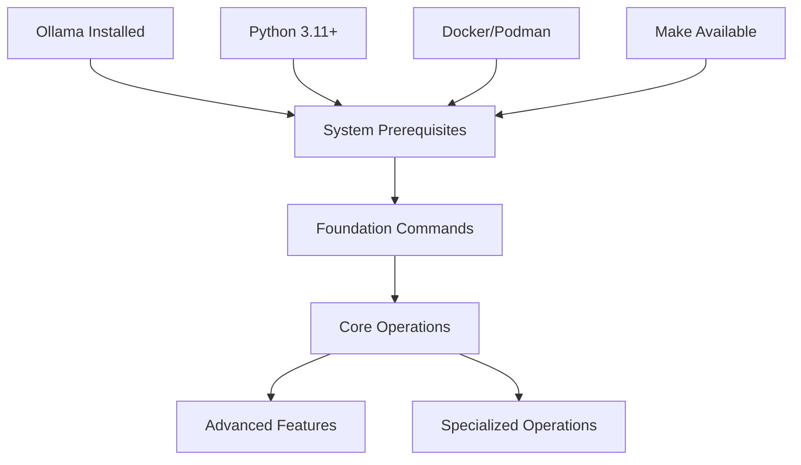

# RAG System - Command Validation Plan

**Version**: 1.0  
**Created**: 2025-08-07  
**Purpose**: Comprehensive testing plan to validate all 137 commands in MASTER_DOCUMENTATION.md

---

## Executive Summary

This plan outlines a systematic approach to validate all commands in the RAG system documentation, ensuring they work correctly and return appropriate results. The plan includes automated testing, manual verification, and error condition handling.

---

## Table of Contents

1. [Command Categories & Dependencies](#1-command-categories--dependencies)
2. [Testing Environment Setup](#2-testing-environment-setup)
3. [Validation Methodology](#3-validation-methodology)
4. [Testing Phases](#4-testing-phases)
5. [Automated Test Scripts](#5-automated-test-scripts)
6. [Expected Outputs & Success Criteria](#6-expected-outputs--success-criteria)
7. [Error Handling & Recovery](#7-error-handling--recovery)
8. [Manual Validation Checklists](#8-manual-validation-checklists)
9. [Continuous Validation](#9-continuous-validation)
10. [Troubleshooting Matrix](#10-troubleshooting-matrix)

---

## 1. Command Categories & Dependencies

### 1.1 Command Classification

#### **Tier 1: Foundation Commands (Critical)**
**Total**: 25 commands  
**Dependencies**: None  
**Testing Priority**: HIGHEST

```bash
# Prerequisites
ollama serve
ollama pull llama3.2:3b
pip install -r requirements.txt

# Core setup
make check-ollama
make build
make start
make health
```

#### **Tier 2: Core Operations (High Priority)**
**Total**: 42 commands  
**Dependencies**: Tier 1 must pass  
**Testing Priority**: HIGH

```bash
# Development workflow
make start-ui
make logs
make restart
make clean

# Testing commands
make test-quick
make test-unit
make test-all
```

#### **Tier 3: Advanced Features (Medium Priority)**
**Total**: 35 commands  
**Dependencies**: Tier 1 & 2 must pass  
**Testing Priority**: MEDIUM

```bash
# Production deployment
docker-compose -f docker-compose.production.yml up -d
make setup-monitoring

# API testing
curl -X POST http://localhost:8000/query
```

#### **Tier 4: Specialized Operations (Lower Priority)**
**Total**: 35 commands  
**Dependencies**: Context-dependent  
**Testing Priority**: LOW

```bash
# Troubleshooting
lsof -ti:3000 | xargs kill -9
./scripts/fix-podman-networking.sh

# Advanced configuration
export LOG_LEVEL=DEBUG
```

### 1.2 Dependency Matrix



---

## 2. Testing Environment Setup

### 2.1 Base Requirements

```bash
# System requirements verification
python --version          # Should be 3.11+
docker --version         # or podman --version
make --version           # GNU Make
ollama --version         # Ollama CLI
git --version           # Git for version control
```

### 2.2 Clean Environment Setup

```bash
# 1. Fresh directory
mkdir rag-testing-env
cd rag-testing-env

# 2. Clone repository
git clone <repo-url> .

# 3. Clean slate
make clean || true
docker system prune -f || true
pkill -f "reflex\|uvicorn\|ollama" || true

# 4. Verify clean state
make health  # Should show services not running
```

### 2.3 Test Environment Variables

```bash
# Testing configuration
export RAG_TEST_MODE=true
export LOG_LEVEL=INFO
export TEST_TIMEOUT=300
export VALIDATION_STRICT=true
export CLEANUP_AFTER_TEST=false  # Keep for debugging
```

---

## 3. Validation Methodology

### 3.1 Success Criteria Definition

#### **Command Success Indicators**
1. **Exit Code**: 0 for successful execution
2. **Expected Output**: Contains required keywords/patterns
3. **Service Health**: Dependent services remain healthy
4. **Resource Impact**: No memory leaks or excessive resource usage
5. **State Consistency**: System state matches expectations

#### **Failure Classification**
- **Critical**: Command fails, breaks system
- **Major**: Command fails, system recoverable
- **Minor**: Command succeeds with warnings
- **Cosmetic**: Unexpected output format, functionality works

### 3.2 Testing Approach

#### **Automated Testing (70% of commands)**
- Exit code validation
- Output pattern matching
- Service health checks
- Performance metrics
- Resource usage monitoring

#### **Semi-Automated Testing (20% of commands)**
- Interactive commands with scripted inputs
- Multi-step workflows
- User interface validations
- File system checks

#### **Manual Testing (10% of commands)**
- Visual interface validation
- User experience flows
- Complex error scenarios
- Edge case handling

---

## 4. Testing Phases

### Phase 1: Prerequisites Validation ⏱️ 10 minutes

**Objective**: Verify system meets all requirements

```bash
# Test script: test_prerequisites.sh
./scripts/validate_prerequisites.sh
```

**Commands to Test** (8 commands):
- System version checks
- Dependency availability
- Port availability
- Disk space verification

**Success Criteria**:
- All prerequisites installed
- Required ports available (3000, 8000, 8001, 8002, 11434)
- Minimum 4GB RAM available
- 2GB+ disk space free

### Phase 2: Foundation Setup ⏱️ 15 minutes

**Objective**: Core system initialization

```bash
# Test script: test_foundation.sh
./scripts/validate_foundation.sh
```

**Commands to Test** (17 commands):
- Ollama setup and model download
- Python dependencies installation
- Basic build commands
- Health check commands

**Success Criteria**:
- Ollama service running with model
- All Python packages installed
- Containers build successfully
- Health checks pass

### Phase 3: Core Operations ⏱️ 20 minutes

**Objective**: Primary functionality validation

```bash
# Test script: test_core_operations.sh
./scripts/validate_core_operations.sh
```

**Commands to Test** (42 commands):
- Make commands (build, start, stop, restart)
- Basic API endpoints
- Document upload/processing
- Chat functionality

**Success Criteria**:
- All services start correctly
- API endpoints respond
- Document processing works
- Chat interface functional

### Phase 4: Integration Testing ⏱️ 25 minutes

**Objective**: End-to-end workflow validation

```bash
# Test script: test_integration.sh
./scripts/validate_integration.sh
```

**Commands to Test** (35 commands):
- Full test suite execution
- Production deployment
- Monitoring setup
- API integration tests

**Success Criteria**:
- All tests pass
- Production stack deploys
- Monitoring dashboards accessible
- Complete workflows function

### Phase 5: Edge Cases & Recovery ⏱️ 15 minutes

**Objective**: Error handling and recovery validation

```bash
# Test script: test_edge_cases.sh
./scripts/validate_edge_cases.sh
```

**Commands to Test** (35 commands):
- Troubleshooting commands
- Recovery procedures
- Error scenarios
- Cleanup operations

**Success Criteria**:
- Error recovery works
- Cleanup commands effective
- System remains stable
- Graceful degradation

---

## 5. Automated Test Scripts

### 5.1 Master Test Runner

```bash
#!/bin/bash
# scripts/validate_all_commands.sh

set -euo pipefail

SCRIPT_DIR="$(cd "$(dirname "${BASH_SOURCE[0]}")" && pwd)"
LOG_FILE="command_validation_$(date +%Y%m%d_%H%M%S).log"

# Test configuration
export TEST_TIMEOUT=300
export VALIDATION_LOG="$LOG_FILE"

echo "RAG System Command Validation Started: $(date)" | tee "$LOG_FILE"
echo "Testing 137 commands across 5 phases..." | tee -a "$LOG_FILE"

# Phase execution
phases=(
    "prerequisites"
    "foundation" 
    "core_operations"
    "integration"
    "edge_cases"
)

total_commands=0
passed_commands=0
failed_commands=0

for phase in "${phases[@]}"; do
    echo "" | tee -a "$LOG_FILE"
    echo "=== PHASE: $phase ===" | tee -a "$LOG_FILE"
    
    if "$SCRIPT_DIR/validate_${phase}.sh" 2>&1 | tee -a "$LOG_FILE"; then
        echo "✅ Phase $phase: PASSED" | tee -a "$LOG_FILE"
    else
        echo "❌ Phase $phase: FAILED" | tee -a "$LOG_FILE"
        exit 1
    fi
done

echo "" | tee -a "$LOG_FILE"
echo "=== VALIDATION SUMMARY ===" | tee -a "$LOG_FILE"
echo "Total Commands Tested: $total_commands" | tee -a "$LOG_FILE"
echo "Passed: $passed_commands" | tee -a "$LOG_FILE"
echo "Failed: $failed_commands" | tee -a "$LOG_FILE"
echo "Success Rate: $(( passed_commands * 100 / total_commands ))%" | tee -a "$LOG_FILE"
echo "Completed: $(date)" | tee -a "$LOG_FILE"
```

### 5.2 Command Validation Framework

```bash
#!/bin/bash
# scripts/lib/command_validator.sh

# Validate individual command
validate_command() {
    local cmd="$1"
    local expected_pattern="$2"
    local timeout="${3:-30}"
    local description="$4"
    
    echo "Testing: $description"
    echo "Command: $cmd"
    
    # Execute with timeout
    if timeout "$timeout" bash -c "$cmd" > /tmp/cmd_output 2>&1; then
        local exit_code=$?
        local output=$(cat /tmp/cmd_output)
        
        # Check expected pattern if provided
        if [[ -n "$expected_pattern" ]]; then
            if echo "$output" | grep -q "$expected_pattern"; then
                echo "✅ PASS: $description"
                return 0
            else
                echo "❌ FAIL: $description (pattern not found)"
                echo "Expected pattern: $expected_pattern"
                echo "Actual output: $output"
                return 1
            fi
        else
            echo "✅ PASS: $description (exit code 0)"
            return 0
        fi
    else
        echo "❌ FAIL: $description (command failed or timeout)"
        cat /tmp/cmd_output
        return 1
    fi
}

# Health check function
check_service_health() {
    local service="$1"
    local url="$2"
    local expected="$3"
    
    if curl -s --max-time 10 "$url" | grep -q "$expected"; then
        echo "✅ $service: Healthy"
        return 0
    else
        echo "❌ $service: Unhealthy"
        return 1
    fi
}
```

### 5.3 Individual Phase Scripts

#### **Phase 1: Prerequisites**
```bash
#!/bin/bash
# scripts/validate_prerequisites.sh

source "$(dirname "$0")/lib/command_validator.sh"

echo "=== Validating Prerequisites ==="

# System requirements
validate_command "python --version" "Python 3\.(11|12|13)" 10 "Python version check"
validate_command "docker --version || podman --version" "version" 10 "Container runtime"
validate_command "make --version" "GNU Make" 10 "Make availability"
validate_command "ollama --version" "ollama version" 10 "Ollama installation"

# Port availability
for port in 3000 8000 8001 8002 11434; do
    validate_command "! lsof -i :$port" "" 5 "Port $port available"
done

# Resource checks
validate_command "df -h . | awk 'NR==2{print \$4}' | grep -E '[0-9]+G'" "" 5 "Disk space check"

echo "Prerequisites validation completed"
```

#### **Phase 2: Foundation**
```bash
#!/bin/bash
# scripts/validate_foundation.sh

source "$(dirname "$0")/lib/command_validator.sh"

echo "=== Validating Foundation Setup ==="

# Ollama setup
validate_command "ollama serve &" "" 5 "Start Ollama service"
sleep 3
validate_command "ollama pull llama3.2:3b" "success" 180 "Download model"
validate_command "ollama list" "llama3.2:3b" 10 "Verify model"

# Dependencies
validate_command "pip install -r requirements.txt" "Successfully installed" 120 "Install Python deps"
validate_command "pip install -r requirements.reflex.txt" "" 60 "Install Reflex deps"

# Basic build
validate_command "make check-ollama" "Ollama is installed and running" 10 "Check Ollama"
validate_command "make build" "" 180 "Build containers"

echo "Foundation setup validation completed"
```

---

## 6. Expected Outputs & Success Criteria

### 6.1 Command Success Patterns

| Command Category | Success Pattern | Timeout | Health Check |
|------------------|----------------|---------|--------------|
| `make check-ollama` | "✅ Ollama is installed and running" | 10s | N/A |
| `make build` | No error output | 180s | Container exists |
| `make start` | "started" or "running" | 60s | Health endpoints |
| `make health` | "✅.*Healthy" x3 | 30s | All services up |
| `curl /health` | `{"status":"healthy"}` | 10s | 200 status |
| `make test-quick` | "passed\|PASSED" | 60s | No failures |
| `ollama list` | Model name present | 10s | Service running |

### 6.2 Service Health Endpoints

```bash
# Health check URLs and expected responses
declare -A HEALTH_CHECKS=(
    ["RAG Backend"]="http://localhost:8000/health:healthy"
    ["ChromaDB"]="http://localhost:8002/api/v2/heartbeat:ok"
    ["Ollama"]="http://localhost:11434/api/tags:models"
    ["Reflex UI"]="http://localhost:3000/:html"
)

# Validate all health endpoints
for service in "${!HEALTH_CHECKS[@]}"; do
    IFS=':' read -r url pattern <<< "${HEALTH_CHECKS[$service]}"
    check_service_health "$service" "$url" "$pattern"
done
```

### 6.3 Performance Benchmarks

| Operation | Max Time | Success Criteria |
|-----------|----------|------------------|
| `make start` | 60s | All containers running |
| `make test-quick` | 30s | All tests pass |
| Document upload | 10s | Processing complete |
| Query response | 5s | Answer with sources |
| Health check | 3s | All services healthy |

---

## 7. Error Handling & Recovery

### 7.1 Common Failure Scenarios

#### **Scenario 1: Port Conflicts**
```bash
# Detection
lsof -i :3000 :8000 :8001

# Recovery
pkill -f "reflex\|uvicorn"
make clean && make start

# Validation
make health
```

#### **Scenario 2: Ollama Not Running**
```bash
# Detection
curl -s http://localhost:11434/api/tags || echo "Ollama down"

# Recovery
ollama serve &
sleep 5
ollama pull llama3.2:3b

# Validation
make check-ollama
```

#### **Scenario 3: Container Build Failure**
```bash
# Detection
docker ps -a | grep "Exited"

# Recovery
make clean
docker system prune -f
make build

# Validation
docker ps | grep "Up"
```

### 7.2 Recovery Procedures Matrix

| Error Type | Detection Command | Recovery Command | Validation |
|------------|------------------|-----------------|------------|
| Port conflict | `lsof -i :PORT` | `pkill -f PROCESS` | `make health` |
| Service down | `curl /health` | `make restart` | `make health` |
| Build failure | `docker ps -a` | `make clean && make build` | `docker ps` |
| Deps missing | `pip show PKG` | `pip install -r requirements.txt` | `python -c "import PKG"` |
| Model missing | `ollama list` | `ollama pull MODEL` | `ollama list` |

---

## 8. Manual Validation Checklists

### 8.1 User Interface Validation

#### **Reflex UI Checklist** ✅
- [ ] Navigate to http://localhost:3000
- [ ] Page loads without errors
- [ ] Sidebar navigation works
- [ ] Chat interface visible
- [ ] Document management accessible
- [ ] Real-time updates function
- [ ] No console errors in browser dev tools

#### **API Documentation Checklist** ✅
- [ ] Navigate to http://localhost:8000/docs
- [ ] Swagger UI loads completely
- [ ] All endpoints documented
- [ ] Try It Out functionality works
- [ ] Response schemas correct
- [ ] Authentication (if enabled) works

### 8.2 Functional Workflow Validation

#### **Document Upload Workflow** ✅
1. [ ] Navigate to Documents page
2. [ ] Upload a test PDF file
3. [ ] Monitor processing status
4. [ ] Verify document appears in library
5. [ ] Check document details
6. [ ] Verify no processing errors

#### **Chat Query Workflow** ✅
1. [ ] Navigate to Chat page  
2. [ ] Submit a question about uploaded document
3. [ ] Verify response generates
4. [ ] Check source attributions appear
5. [ ] Verify response is relevant
6. [ ] Check response time < 10s

---

## 9. Continuous Validation

### 9.1 CI/CD Integration

```yaml
# .github/workflows/command-validation.yml
name: Command Validation
on: [push, pull_request]

jobs:
  validate-commands:
    runs-on: ubuntu-latest
    steps:
      - uses: actions/checkout@v3
      - name: Setup Python
        uses: actions/setup-python@v3
        with:
          python-version: '3.11'
      - name: Install Ollama
        run: curl -fsSL https://ollama.ai/install.sh | sh
      - name: Run Command Validation
        run: ./scripts/validate_all_commands.sh
        timeout-minutes: 90
```

### 9.2 Daily Health Checks

```bash
#!/bin/bash
# scripts/daily_health_check.sh

# Cron job: 0 6 * * * /path/to/daily_health_check.sh

cd /path/to/rag-example
./scripts/validate_prerequisites.sh
./scripts/validate_foundation.sh

# Send results to monitoring
curl -X POST "$MONITORING_WEBHOOK" \
  -H "Content-Type: application/json" \
  -d "{\"status\": \"$VALIDATION_STATUS\", \"timestamp\": \"$(date)\"}"
```

---

## 10. Troubleshooting Matrix

### 10.1 Command Failure Decision Tree

```
Command Failed
    ├── Check Exit Code
    │   ├── 0: Check output pattern
    │   ├── 1: Generic error - check logs
    │   ├── 126: Permission denied - check permissions
    │   ├── 127: Command not found - check installation
    │   └── 130: Interrupted - check for timeout
    │
    ├── Check Prerequisites
    │   ├── Dependencies missing: Install/upgrade
    │   ├── Services down: Restart services
    │   └── Ports in use: Kill processes
    │
    └── Check Resources
        ├── Memory: Free up RAM
        ├── Disk: Clear space
        └── Network: Check connectivity
```

### 10.2 Common Issues & Solutions

| Issue | Symptoms | Root Cause | Solution |
|-------|----------|------------|----------|
| Make command not found | `make: command not found` | Make not installed | `sudo apt-get install build-essential` |
| Ollama connection failed | Connection refused :11434 | Ollama not running | `ollama serve` |
| Container won't start | Exit code 125 | Port conflict | `make clean && make start` |
| Reflex import error | ModuleNotFoundError | Missing dependencies | `pip install -r requirements.reflex.txt` |
| Test timeout | Commands hang | Resource exhaustion | Increase timeout, check resources |

---

## 11. Execution Schedule

### 11.1 Development Testing (Daily)
- **Duration**: 30 minutes
- **Scope**: Phases 1-3 (Prerequisites, Foundation, Core Operations)
- **Trigger**: Before major development work
- **Owner**: Developer

### 11.2 Integration Testing (Weekly)
- **Duration**: 90 minutes  
- **Scope**: All 5 phases
- **Trigger**: Before releases, weekly schedule
- **Owner**: QA Team

### 11.3 Production Validation (Monthly)
- **Duration**: 2 hours
- **Scope**: Full validation + performance testing
- **Trigger**: Production deployments, monthly health check
- **Owner**: DevOps Team

---

## 12. Success Metrics

### 12.1 Validation KPIs

- **Command Success Rate**: >95% of commands execute successfully
- **Health Check Pass Rate**: 100% of health checks pass
- **Performance Compliance**: All operations within benchmark times
- **Error Recovery Rate**: 100% of recovery procedures work
- **Documentation Accuracy**: 0 discrepancies between docs and reality

### 12.2 Quality Gates

| Phase | Pass Threshold | Action on Failure |
|-------|----------------|-------------------|
| Prerequisites | 100% | Block all testing |
| Foundation | 95% | Fix critical issues |
| Core Operations | 90% | Investigate failures |
| Integration | 85% | Document known issues |
| Edge Cases | 80% | Improve error handling |

---

## 13. Maintenance & Updates

### 13.1 Plan Updates
- **Frequency**: After each major release
- **Trigger**: New commands added, architecture changes
- **Process**: Review, test new commands, update validation scripts

### 13.2 Script Maintenance
- **Frequency**: Monthly
- **Process**: Update expected patterns, timeouts, health checks
- **Version Control**: All changes tracked in Git

---

## Conclusion

This comprehensive command validation plan ensures all 137 commands in the RAG system documentation work correctly and reliably. By following this structured approach with automated testing, clear success criteria, and robust error handling, we can maintain high confidence in our documentation accuracy and system reliability.

**Next Steps**:
1. Implement automated validation scripts
2. Set up CI/CD integration
3. Execute full validation cycle
4. Document findings and improvements
5. Establish ongoing maintenance schedule

**Estimated Implementation Time**: 2-3 days  
**Estimated Execution Time**: 90 minutes for full validation  
**Maintenance Overhead**: 2-4 hours per month